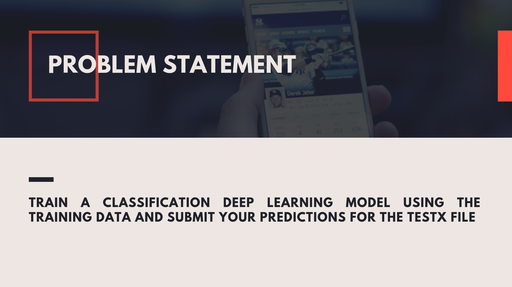
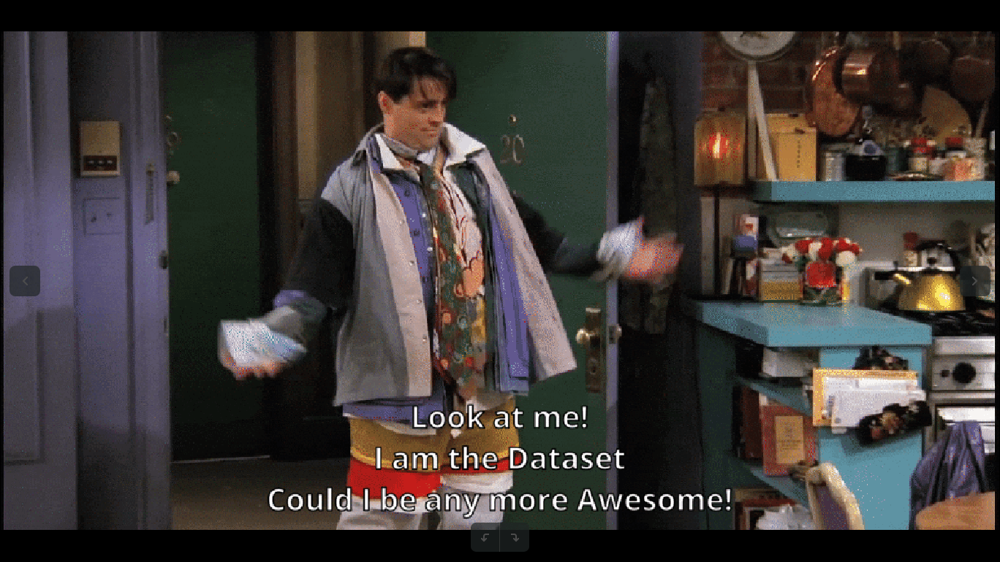
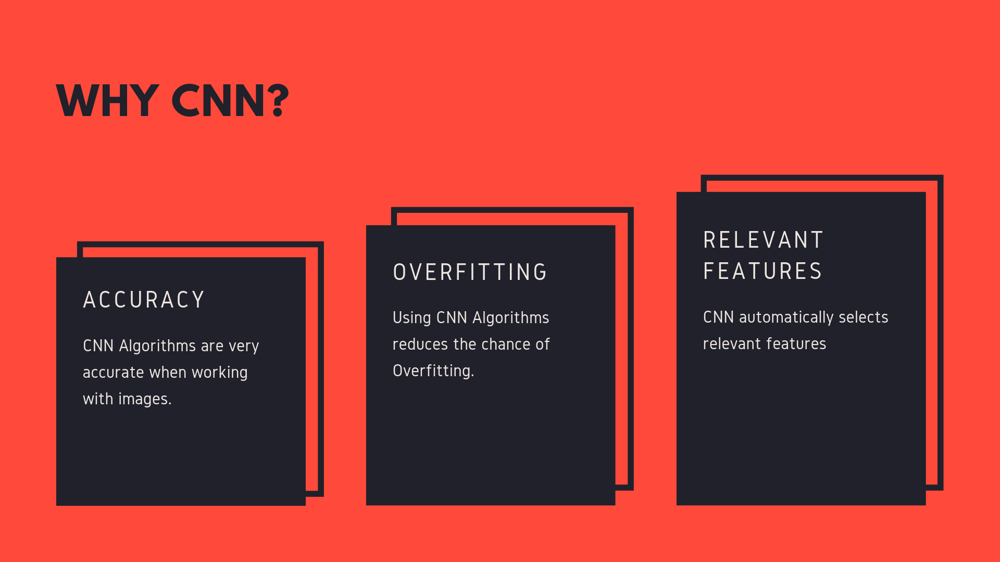

# LastAssignment_DeepLeraning_CNN_Classification

 

#

## Dataset

* trainX : Training data consisting of 60K samples
* trainY : Labels for the 60K training samples
* testX  : Test data consisting of 10K samples on which predictions are to be performed

#

#

